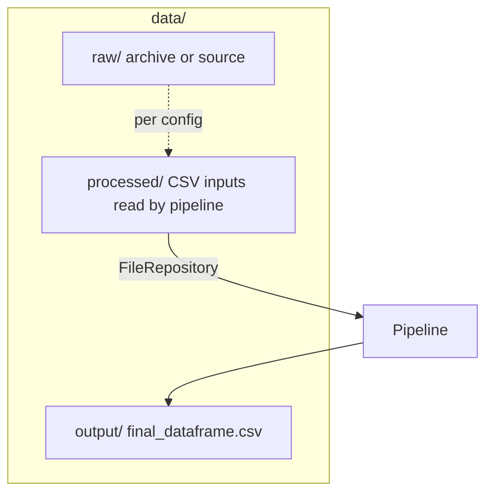

# `data/` directory (layout)

## Role

Not a code package: holds **batch pipeline inputs and outputs**. Paths are defined by root `config.yaml`: `data.raw_path`, `data.processed_path`, `data.output_path`.

## Directory structure (diagram)

## Data flow (diagram)

