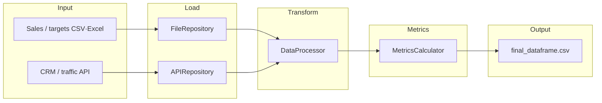

# 01 Pipeline overview

This guide walks through the **end-to-end data flow** and **code layers**. Read the numbered docs in order.

## End-to-end data flow

## Mapping to source layout

| Stage | Role | Read next |
|-------|------|-----------|
| Startup | `main.py`, config validation | [02-startup-and-config](02-startup-and-config.md) |
| Ingestion | File + API repositories | [03-data-ingestion](03-data-ingestion.md) |
| Cleaning | Dates, community names, merges | [04-cleaning-and-transformation](04-cleaning-and-transformation.md) |
| Metrics | Group, merge, derived columns | [05-metrics](05-metrics.md) |
| Orchestration | Six-step pipeline, CSV, logs | [06-orchestration-and-output](06-orchestration-and-output.md) |
| Wiring | DI, factories | [07-di-and-factories](07-di-and-factories.md) |

## Design patterns (short)

Composition root (`main`) + DI (`DIContainer`) + factories (`RepositoryFactory` / `ServiceFactory`) + repositories (`FileRepository` / `APIRepository`) + application services (`DataService` / `PipelineService`) + protocol-based strategies (processor, calculator, API client).

---

**Next:** [02-startup-and-config](02-startup-and-config.md)
