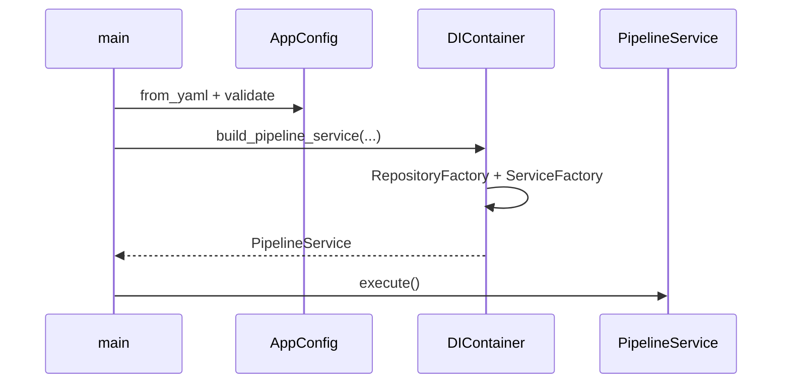

# 02 Startup and configuration

## Flow

1. `main.py` loads `config.yaml` → `AppConfig.from_yaml()`.
2. `validate()` checks API and logging settings.
3. Build `APIClient` (if `base_url` and `api_key` are set), `DataProcessor.from_config(config)`, and `MetricsCalculator()`.
4. `DIContainer(config).build_pipeline_service(...)` wires `PipelineService` and runs `execute()`.

## Key configuration

- `api`: base URL, key, timeout, endpoints.
- `data`: `raw_path` / `processed_path` / `output_path` (`FileRepository` uses the configured raw path).
- `community_names`: aliases and URL `path_slugs` for `DataProcessor`.
- `logging`: level and format.

## Deeper architecture

- Application composition: [`src/ARCHITECTURE.md`](reference/architecture-src.md)
- Config and protocols: [`src/core/ARCHITECTURE.md`](reference/architecture-core.md)

---

**Previous:** [01-pipeline-overview](01-pipeline-overview.md)  
**Next:** [03-data-ingestion](03-data-ingestion.md)
