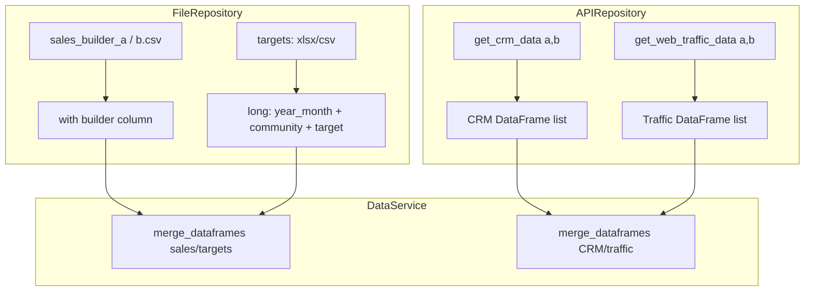

# 03 Data ingestion

## Role

Turn raw records from **files** and the **HTTP API** into `pandas.DataFrame` instances for downstream steps.

## Flow

- Sales and targets: loaded per builder, merged in `DataService` via `DataProcessor.merge_dataframes`.
- CRM / traffic: empty DataFrames if no API client; on failure, log a warning and degrade to empty tables.

## Deeper architecture

- [`src/repositories/ARCHITECTURE.md`](reference/architecture-repositories.md)
- HTTP adapter: [`src/core/clients/ARCHITECTURE.md`](reference/architecture-clients.md)

---

**Previous:** [02-startup-and-config](02-startup-and-config.md)  
**Next:** [04-cleaning-and-transformation](04-cleaning-and-transformation.md)
