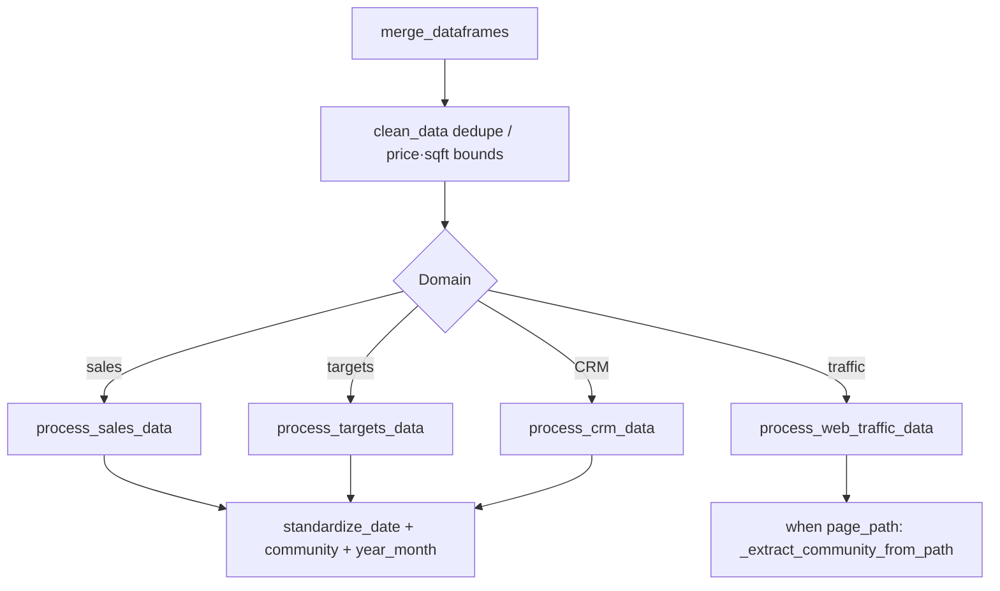

# 04 Cleaning and transformation

## Role

`DataProcessor` (inside `DataService`) **deduplicates**, **filters outliers**, **standardizes dates and community names**, and derives fields such as `year_month`.

## Flow

- Display names: generic regex + `community_names.aliases` in `config.yaml`.
- URL paths: match `path_slugs` longest-first to reduce false matches.

## Deeper architecture

- [`src/core/processors/ARCHITECTURE.md`](reference/architecture-processors.md)

---

**Previous:** [03-data-ingestion](03-data-ingestion.md)  
**Next:** [05-metrics](05-metrics.md)
