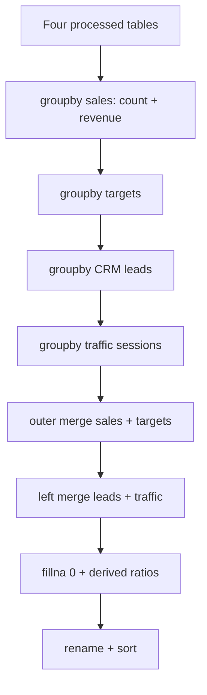

# 05 Metrics

## Role

`MetricsService` delegates to `MetricsCalculator` to aggregate sales, targets, leads, and traffic at **month × community × builder**, then compute variance, achievement rate, averages, and conversion metrics.

## Flow

## Deeper architecture

- [`src/core/calculators/ARCHITECTURE.md`](reference/architecture-calculators.md)
- Thin service layer: [`src/services/ARCHITECTURE.md`](reference/architecture-services.md) (includes `MetricsService`)

---

**Previous:** [04-cleaning-and-transformation](04-cleaning-and-transformation.md)  
**Next:** [06-orchestration-and-output](06-orchestration-and-output.md)
