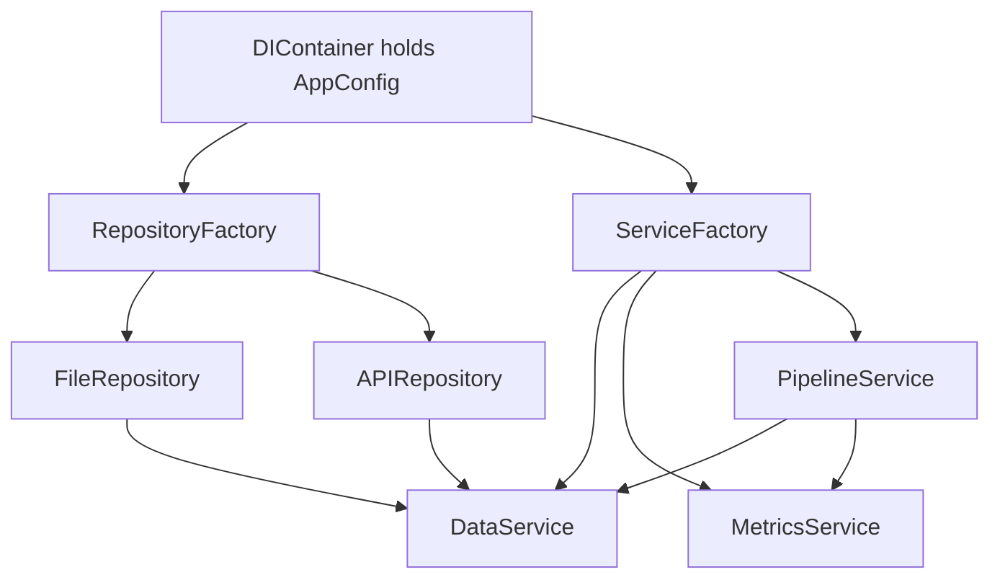

# 07 Dependency injection and factories

## Role

Without changing domain constructor signatures, `DIContainer` uses factories to create `FileRepository`, `APIRepository`, `DataService`, `MetricsService`, and `PipelineService` and wire the full graph.

## Flow

## Deeper architecture

- [`src/di/ARCHITECTURE.md`](reference/architecture-di.md)
- [`src/factories/ARCHITECTURE.md`](reference/architecture-factories.md)
- Full-stack dependency graph: [`src/ARCHITECTURE.md`](reference/architecture-src.md)

---

**Previous:** [06-orchestration-and-output](06-orchestration-and-output.md)  
**Back to overview:** [01-pipeline-overview](01-pipeline-overview.md)
