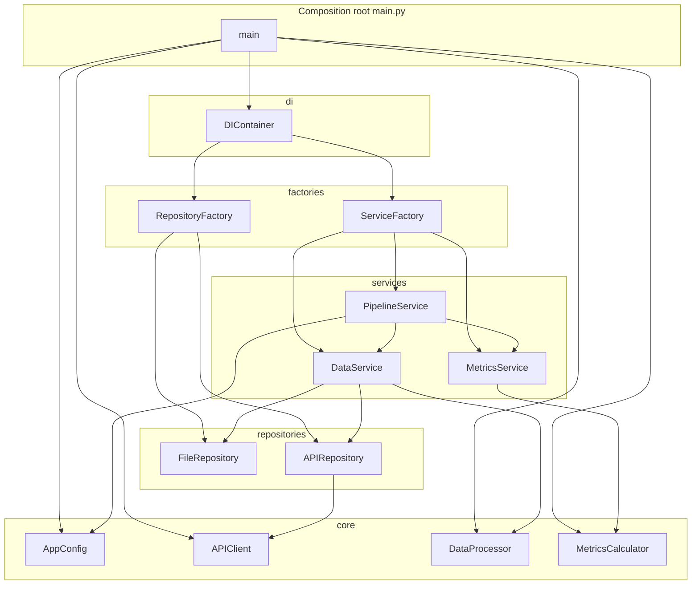
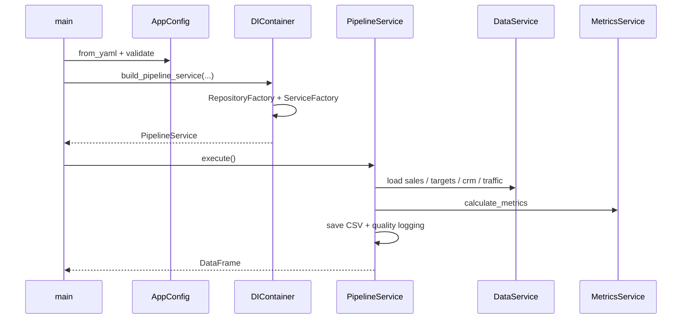

# `src/` architecture

## Design patterns in this layer

| Pattern | Where |
|---------|--------|
| **Composition root** | `main.py` wires config, clients, container, and services at process entry |
| **Dependency injection** | `DIContainer` injects repositories and services into `PipelineService` |
| **Abstract factory (lightweight)** | `RepositoryFactory` / `ServiceFactory` create families of objects from config |
| **Facade** | `PipelineService` hides multi-step load, compute, and persist details |

## Module dependency (diagram)

## Startup and orchestration (sequence)

