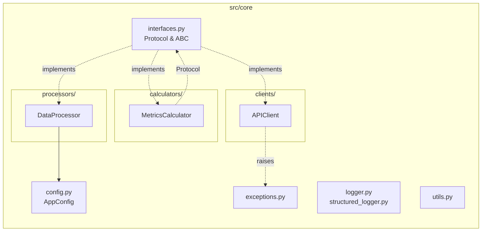
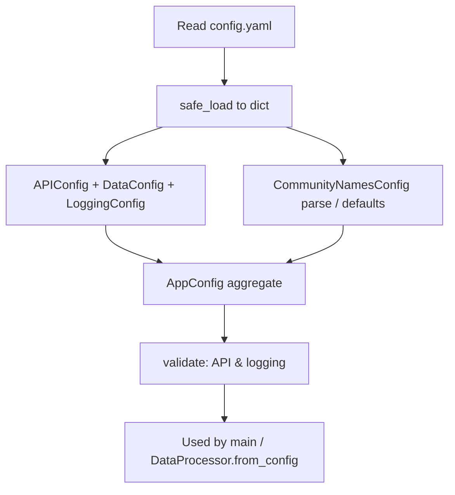

# `core/` architecture

## Design patterns in this layer

| Pattern | Where |
|---------|--------|
| **Protocol (structural typing)** | `IDataProcessor`, `IAPIClient`, `IMetricsCalculator`, etc. — pluggable implementations |
| **ABC / template** | `IConfiguration`, `DataRepository` (under `repositories`), and other contracts |
| **Configuration aggregate** | `AppConfig` and nested dataclasses (`APIConfig`, `DataConfig`, `CommunityNamesConfig`) |
| **Centralized error model** | Layered exceptions in `exceptions.py` for consistent handling upstream |

## Package layout (diagram)

## Configuration load flow (diagram)

