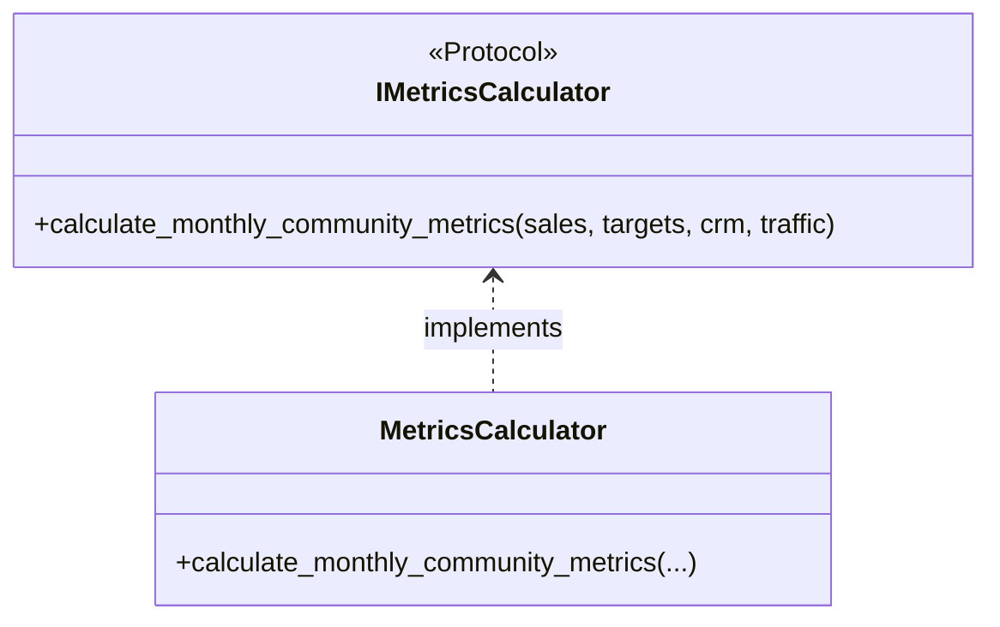
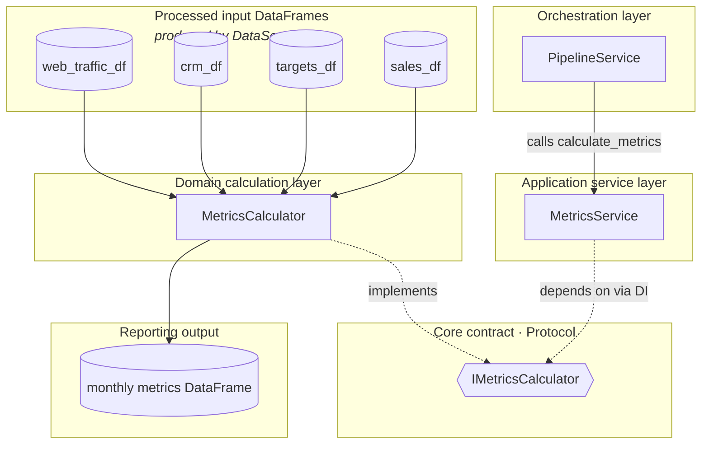

# `core/calculators/` architecture

## Design patterns in this layer

| Pattern | Where |
|---------|--------|
| **Strategy** | `MetricsCalculator` implements `IMetricsCalculator`; replace the whole formula set |
| **Pure domain service** | No I/O; only group, merge, and derive columns on DataFrames |

## Class diagram

## Metrics architecture (diagram)

