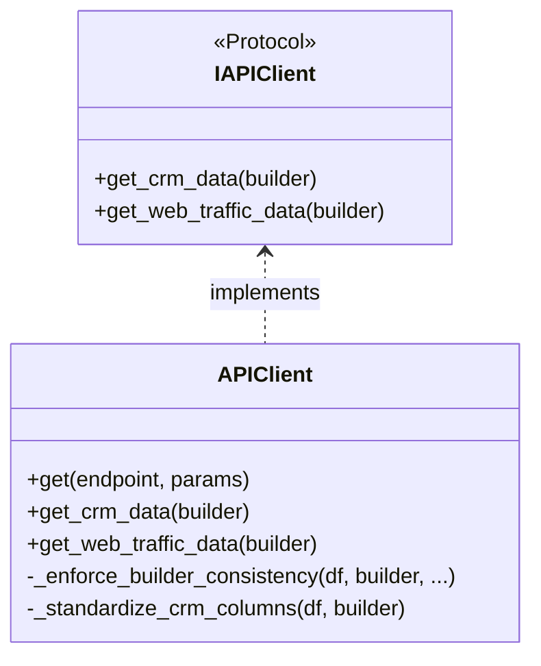
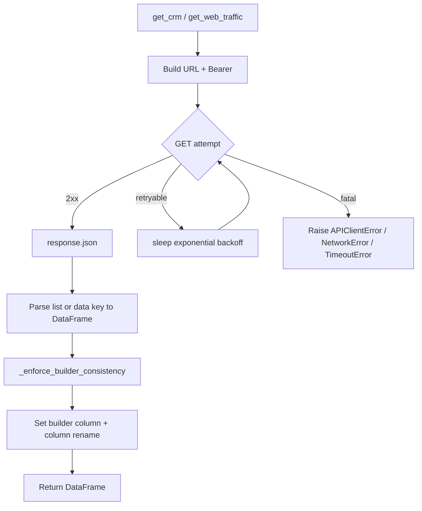

# `core/clients/` architecture

## Design patterns in this layer

| Pattern | Where |
|---------|--------|
| **Gateway / adapter** | `APIClient` maps HTTP JSON to `pandas.DataFrame` |
| **Retry + backoff** | Limited retries on timeout, connection errors, and selected 5xx |
| **Guard / defensive filter** | `_enforce_builder_consistency` prevents cross-builder data leakage |

## Classes and protocol (diagram)

## HTTP call flow (diagram)

