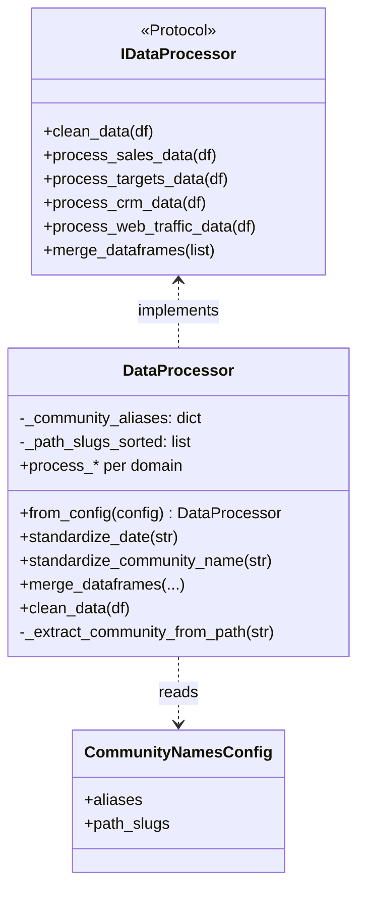

# `core/processors/` architecture

## Design patterns in this layer

| Pattern | Where |
|---------|--------|
| **Strategy (interface-level)** | `DataProcessor` implements `IDataProcessor`; swap at composition root |
| **Configurable transformation** | Community aliases and URL slugs come from `CommunityNamesConfig`, not hard-coded in class |

## Classes and config (diagram)

## Data processing flow (diagram)

```mermaid
flowchart TD
    subgraph Sales["process_sales_data"]
        S1[standardize_date] --> S2[standardize_community_name]
        S2 --> S3[derive year_month]
    end
    subgraph Targets["process_targets_data"]
        T1[standardize_community_name] --> T2[numeric target_sales]
    end
    subgraph CRM["process_crm_data"]
        C1[pick date column, standardize_date] --> C2[year_month]
        C2 --> C3[community column, standardize_community_name]
    end
    subgraph Web["process_web_traffic_data"]
        W1[pick date column] --> W2[year_month]
        W2 --> W3{column type}
        W3 -->|page_path| W4[_extract_community_from_path<br/>config slug match]
        W3 -->|other| W5[standardize_community_name]
    end
    subgraph Merge["merge_dataframes"]
        M1[multiple builder DataFrames] --> M2[concat or key merge]
    end
```

