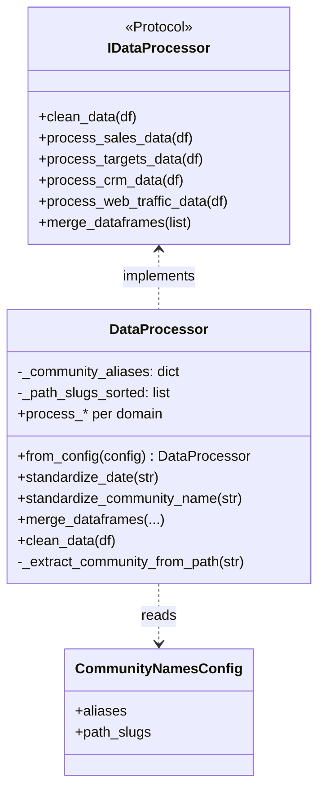
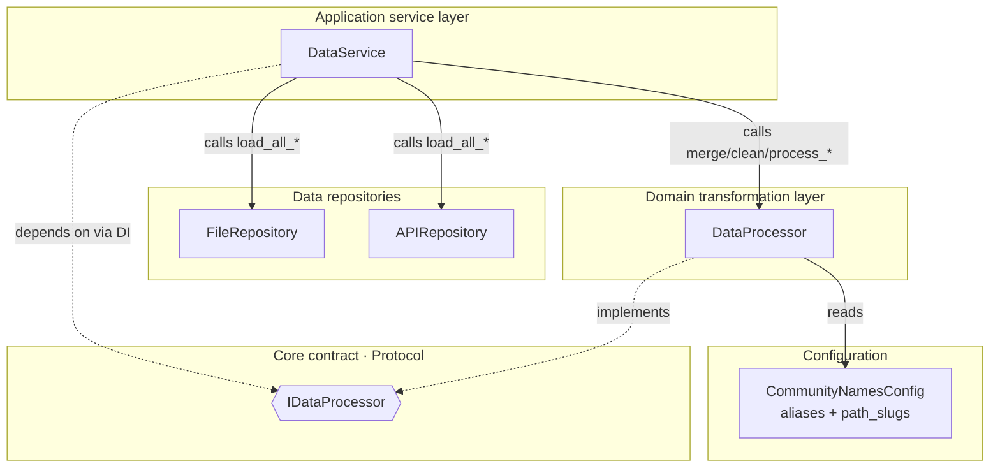
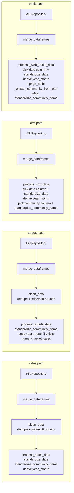

# `core/processors/` architecture

## Design patterns in this layer

| Pattern | Where |
|---------|--------|
| **Strategy (interface-level)** | `DataProcessor` implements `IDataProcessor`; swap at composition root |
| **Configurable transformation** | Community aliases and URL slugs come from `CommunityNamesConfig`, not hard-coded in class |

## Classes and config (diagram)

## Component architecture (diagram)

## Four-path processing architecture (diagram)

**Key differences:**
- Sales and targets use `clean_data` for outlier filtering; CRM and traffic skip it.
- Targets do not call `standardize_date`; they only standardize community names and ensure numeric target values.
- CRM and traffic pick date/community columns dynamically based on what the API response contains.
- Traffic uses `_extract_community_from_path` for `page_path` columns, matching `path_slugs` longest-first.
