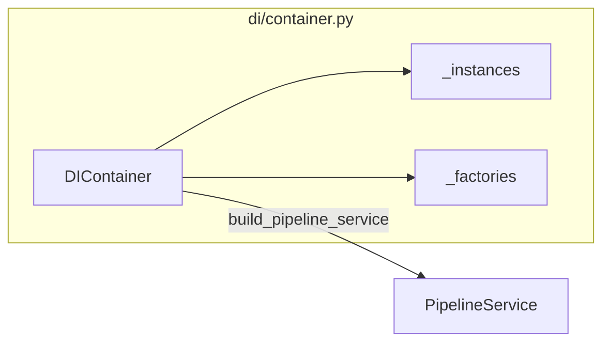
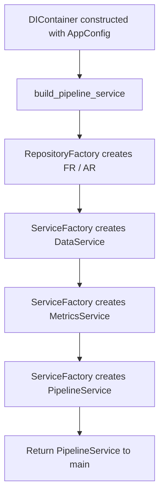

# `di/` architecture

## Design patterns in this layer

| Pattern | Where |
|---------|--------|
| **Lightweight DI container** | `DIContainer` holds `AppConfig` and resolves the graph in `build_pipeline_service` |
| **Service locator (sketch)** | `register_singleton` / `register_factory` / `get` reserved; main path uses `build_pipeline_service` |

## Container responsibilities (diagram)

## Wiring flow (diagram)

