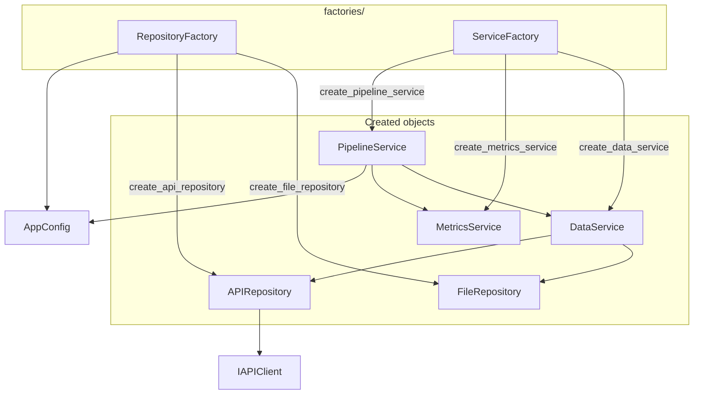
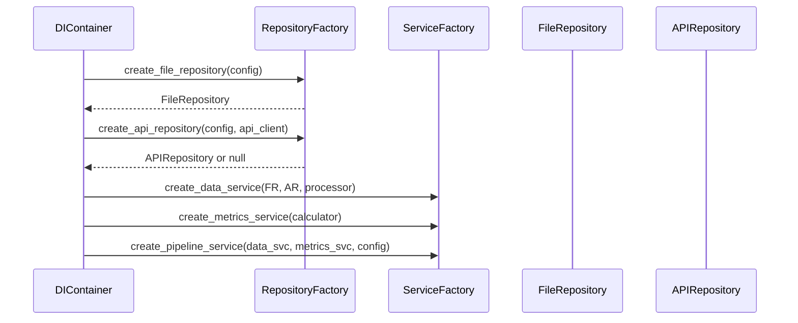

# `factories/` architecture

## Design patterns in this layer

| Pattern | Where |
|---------|--------|
| **Simple / static factory** | Static methods create objects and hide construction details |
| **Single entry for config** | Factories take `AppConfig` (and optional `IAPIClient`) so paths and API stay consistent |

## Factories and products (diagram)

## Creation order (sequence)

