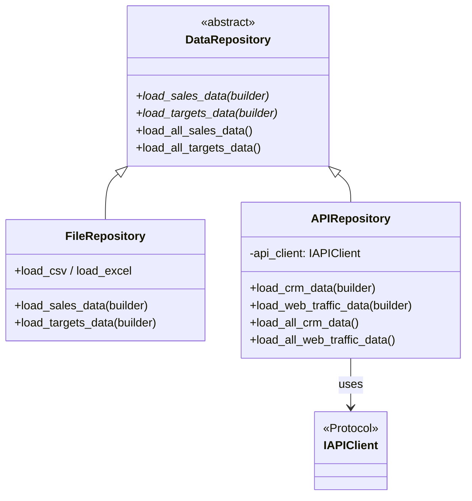
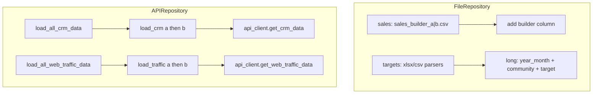

# `repositories/` architecture

## Design patterns in this layer

| Pattern | Where |
|---------|--------|
| **Repository** | Hides data source details; exposes “load per builder” semantics |
| **Abstract class + template method** | `DataRepository` provides default `load_all_sales_data` / `load_all_targets_data` |
| **Specialized repository** | `FileRepository` (CSV/Excel), `APIRepository` (delegates to `IAPIClient`) |

## Class diagram

## Load flow (diagram)

