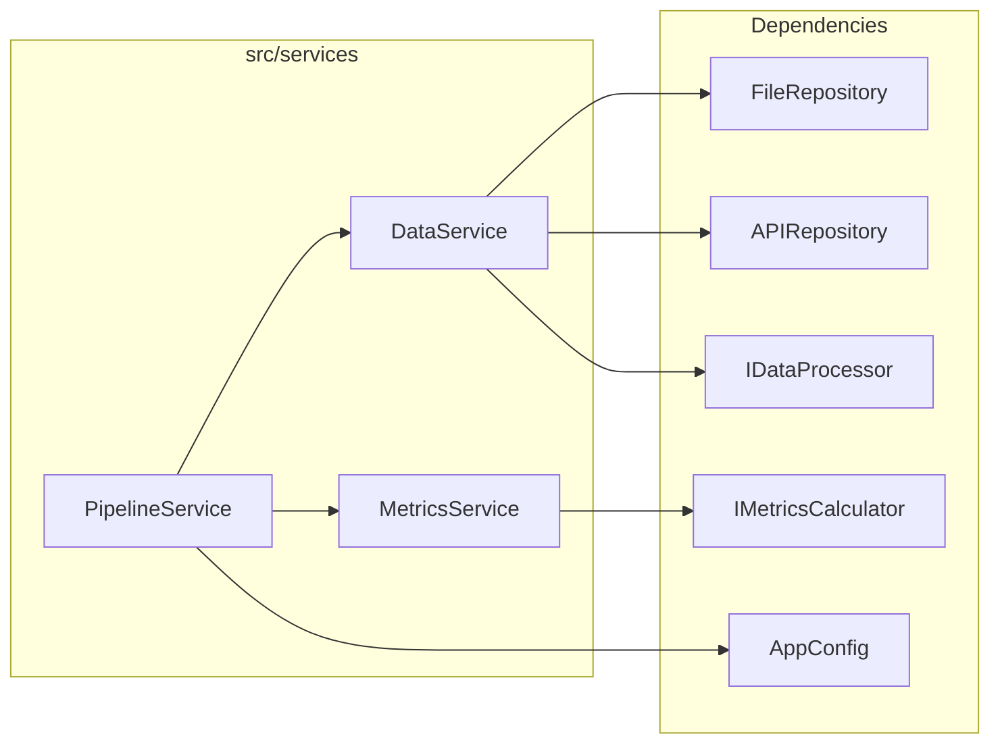
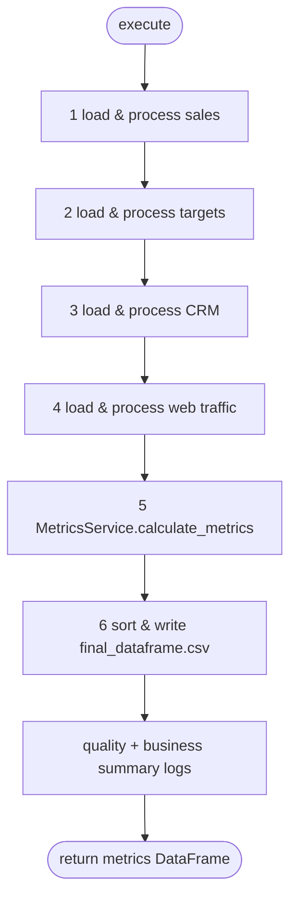

# `services/` architecture

## Design patterns in this layer

| Pattern | Where |
|---------|--------|
| **Application service** | `DataService` / `MetricsService` — use-case operations coordinating repos and domain helpers |
| **Orchestration / workflow** | `PipelineService.execute()` drives fixed steps (lightweight **template method** / process script) |
| **Facade** | `PipelineService` exposes a single `execute()` to `main` |
| **Graceful degradation** | Missing API repo or CRM/traffic failures yield empty tables with logging (`DataService`) |

## Collaboration (diagram)

## Pipeline execution (diagram)

