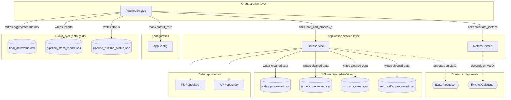
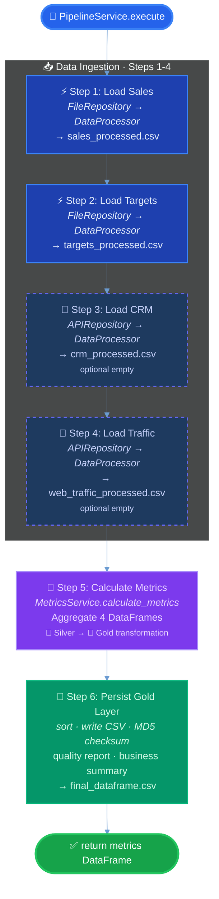

# `services/` architecture

## Design patterns in this layer

| Pattern | Where |
|---------|--------|
| **Application service** | `DataService` / `MetricsService` — use-case operations coordinating repos and domain helpers |
| **Orchestration / workflow** | `PipelineService.execute()` drives fixed steps (lightweight **template method** / process script) |
| **Facade** | `PipelineService` exposes a single `execute()` to `main` |
| **Graceful degradation** | Missing API repo or CRM/traffic failures yield empty tables with logging (`DataService`) |
| **Medallion Architecture** | `DataService` persists Silver layer outputs (cleaned DataFrames) to `data/processed/` |

## Component architecture (diagram)



## Six-step execution flow (diagram)



## Silver layer persistence (Medallion Architecture)

### Purpose

The **Silver layer** (`data/silver/`) stores cleaned and standardized DataFrames after transformation, providing:

- **Audit trail**: Intermediate data for debugging and quality validation
- **Reusability**: Cleaned data can be consumed by other downstream processes
- **Data lineage**: Clear separation between raw ingestion and business aggregation

### Implementation

`DataService._save_to_silver_layer()` is called after each data processing step:

| Step | Input (Bronze) | Output (Silver) | Transformations |
|------|---------------|-----------------|-----------------|
| 1. Sales | `data/bronze/sales_builder_*.csv` | `data/silver/sales_processed.csv` | Deduplication, date standardization, community normalization |
| 2. Targets | `data/bronze/target_sales_builder_*.*` | `data/silver/targets_processed.csv` | Community normalization, month column addition |
| 3. CRM | API `/crm` | `data/silver/crm_processed.csv` | Date standardization, community mapping, column unification |
| 4. Traffic | API `/web-traffic` | `data/silver/web_traffic_processed.csv` | Community mapping, year_month extraction |

### Configuration

Silver layer path is configured in `config.yaml`:

```yaml
data:
  processed_path: "data/silver"  # Silver layer
```

The `DIContainer` passes `config.data.get_processed_path()` to `DataService` during initialization.
